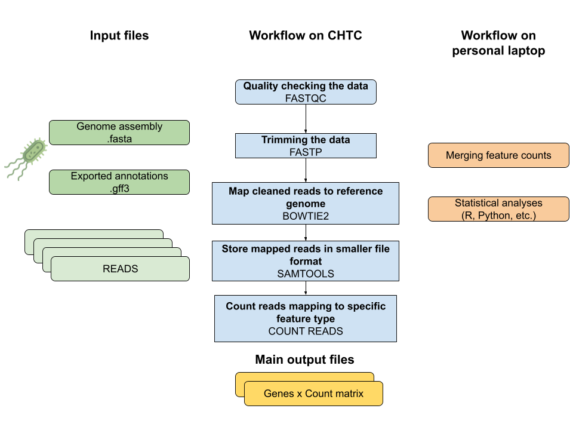

# sr-rnaseq
Example data processing of short reads rna-seq

# ✨ Overview

The purpose of this workflow is to process short read bulk RNA-seq data in a high-throughput manner. The workflow consists of standard QC/QA pre-processing steps, after which cleaned RNA-seq reads are mapped onto a reference genome. Then, counts for each genes are calculated.

# 🖥️  Infrastructure

To implement this workflow, a preannotated genome and pairs of R1 and R2 reads for each sample. For the QA and QC step, each reads file is its own HTCondor job. For the mapping, paired-reads are considered for each HTCondor job.

For example, with 40 samples (80 fastqc reads), we would simultaneously submit 80 jobs for the fastqc and fastp steps, and 40 jobs for steps starting at mapping. 

One of the longer step of such as workflow is the mapping step, when reads are mapped to the reference genome. If each time a pair of reads is mapped to the genome takes 10 minutes to run, it would take 40 samples X 10 mins = 400 mins > 6 hour for all 40 samples to run. Comparatively, using High Throughput Computing, the tasks are submitted and run "almost all at the same time" which substantially reduces the compute time needed to obtain results. In the best case scenario, it could only take ~10 minutes to run all 40 samples at once.



## On CHTC
1. Quality Checking
2. Trimming
3. Mapping reads to reference genome
4. Count reads mapping to each feature

## On your laptop
1. Merge output tables
2. Perform differential gene expression analysis

# 🔁 How to recreate this workflow

**1. Download a copy of the code**

```
ssh username@ap2002.chtc.wisc.edu
pwd
# should say /home/username
git clone https://github.com/UW-Madison-Bacteriology-Bioinformatics/sr-rnaseq.git
cd sr-rnaseq
chmod +x scripts/*.sh
```

**2. Create the folder structure**
A helper script, `pre-processing.sh` is present to help you organize your input and output files.

Modify the variable `LOCATION` and `PROJECT` accordingly:
```
nano scripts/pre-processing.sh
# change the variables
# save and exit
```

> [!NOTE]  
> You must already have a CHTC `/staging` folder for this to work.

```
bash scripts/pre-processing.sh
```

**3. Organize your files**

Using Globus, or `scp` transfer the relevant input files to your `/staging/username/project/input` folder.
You will need:
 - Move your fastq reads (2 for each samples, labelled sample_R{1 or 2}_001.fastq.gz
 - Also move your reference genome assembly (named reference_assembly.fasta and gbk files) here

**4. Prepare your list of reads, and your list of samples**
You will need 2 files overall for the `queue` statement of these scripts.
The first file, `reads.txt` is a file with 1 fastq file per line.
The second file, `samples.txt` is similar, but contains 1 sample name per line.
You will have twice as many lines in the `reads.txt` compared to the `samples.txt` file because the reads file contains both forward and reverse reads for each sample.
Create a list of reads:

```
cd /staging/$LOGNAME/$PROJECTNAME/input
# this mean list the files, then replace everything before the space with nothin, and then replace the _R1/2_fastq.gz part of the name with nothing.
ls -lht | grep '.fastq.gz' | sed 's|.* ||g' > reads.txt
grep 'R1_001.fastq.gz' reads.txt | sed 's|_R1_001.fastq.gz||g' > samples.txt
# Move both to the scripts folder
mv reads.txt ~/sr-rnaseq/scripts/.
mv samples.txt ~/sr-rnaseq/scripts/.
cd ~/sr-rnaseq/scripts
```

**Prepare to run the scripts using `condor_submit`**

Navigate to your `sr-rnaseq/scripts` folder and ensure that the path to the base project (`staging=/staging/netid/projectname`) aligns with the way you organized your folders.
Change paths as necessary.
Create a log folder first:


```
mkdir logs
# Perform quality check of reads
condor_submit fastqc.sub
# Trim reads
condor_submit fastp.sub
# Map reads to reference genome
condor_submit bowtie2.sub
# Convert sam to bam format
condor_submit samtools.sub
```

Note: The `featurescounts.sub` file take in a GTF file as an input. If you have a GFF3 file, you can search for how to convert that into a GTF File, using the script `GFF2GTF.sub` from the `AGAT` software. Prior to running the `GFF2GTF.sub` script, make sure that the feature you are interested in is labelled properly in the "table" section of the GFF3 file. For more information about the GFF3 file format, visit this [website](https://www.ncbi.nlm.nih.gov/datasets/docs/v2/reference-docs/file-formats/annotation-files/about-ncbi-gff3/)
For example, if you manually annotated a region using an external software, the column `type` might be label it as "region" or "misc_feature", instead of "gene", so you will want to manually edit the GFF3 file. 

```
# Convert GFF to GTF
condor_submit GFF2GTF.sub
# Calculate the number of reads mapped to certain features
condor_submit featurescount.sub
```


